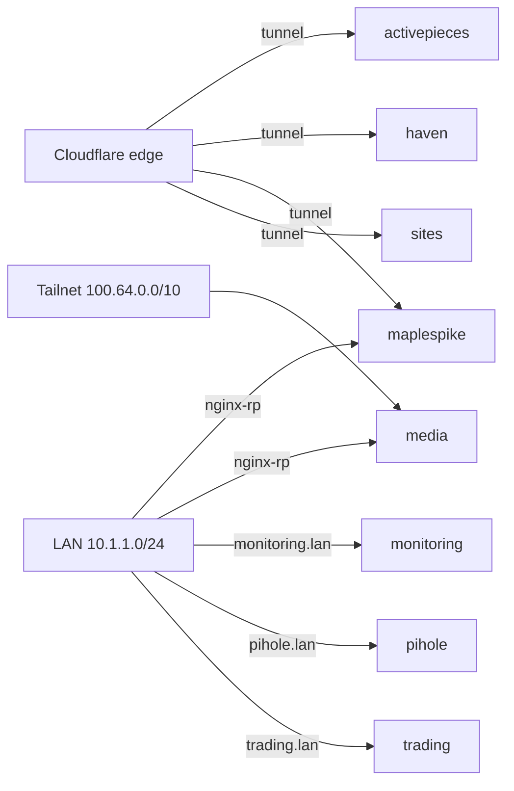

<!-- GENERATED by bin/inventory-render - edit inventory/*.yaml, not this file -->
# Homelab architecture map

_Inventory updated: 2026-09-26_

## Hosts

| Host | LAN | Tailnet | OS | Role | GPUs |
|---|---|---|---|---|---|
| forge | 10.1.1.130 | 100.85.63.36 | Arch (Omarchy) | k3s control-plane; inference (llama servers) | 2x RTX 4060 8G, 2x RX 5700 XT (AMD inference) |
| nexus | 10.1.1.120 | 100.76.105.73 | Arch (Omarchy) | ops/builder; k3s control-plane; media + trading; fleet broker | RTX 3060 Ti 8G |
| sentry | 10.1.1.140 | 100.105.246.35 | Arch (Omarchy) | k3s control-plane; edge tasks; desktop (Hyprland) session | AMD Navi 10 (RX 5600 XT/5700-class) - console GPU |
| zephyr | 10.1.1.110 | 100.91.11.2 | Arch (Omarchy) | workstation; k3s agent (cordoned); GPU ops only - no services/timers/state | RTX 3090 24G, RTX 3060 Ti 8G |

## Devices

| Device | LAN | Tailnet | OS | Role |
|---|---|---|---|---|
| krash2 | 10.1.1.79 | - | Windows 11 | miner (RTX 4060); qBittorrent (priority-2) |
| krash3 | 10.1.1.150 | 100.70.222.88 | Windows 11 | miner (RTX 4060, opportunistic) |
| omarchy-williams | - | 100.72.127.120 | - | unclassified tailnet device - identify and rename |
| oracle-vps | - | 100.64.0.1 | - | Oracle edge - Haven relay; headscale control plane |
| reverb256-edge-02 | - | - | - | Oracle edge - Haven standby relay |

## Network

- LAN `10.1.1.0/24` gw `10.1.1.1` | DNS VIP `10.1.1.100` | DNS `10.1.1.53` | IPv6 `2604:3d09:ae89:2700::/64`
- Tailnet `100.64.0.0/10`
- k3s (k3s, Calico (VXLAN)): services `10.43.0.0/16`, pods `192.168.0.0/16`; CP nexus, forge, sentry; agents zephyr

## Kubernetes namespaces

| Namespace | Purpose | Exposure | Isolation |
|---|---|---|---|
| activepieces | automation flows | cloudflare-tunnel | none |
| argocd | GitOps controller (app-of-apps) | lan | default-deny |
| astral-key | quill auth sidecar (passkey / wallet SIWE / JWT) | cluster-internal | default-deny |
| calico-apiserver | Calico API | cluster-internal | default-deny |
| calico-system | Calico dataplane | cluster-internal | none |
| chatterbox | Chatterbox TTS service | cluster-internal | none |
| cloudflared | Cloudflare tunnel connectors | egress-only | none |
| default | unused - no workloads run here | - | none |
| external-secrets | ESO - BSM -> k8s secrets | cluster-internal | none |
| haven | Haven bot/relay | cloudflare-tunnel | none |
| kube-node-lease | k3s system | cluster-internal | none |
| kube-public | k3s system | cluster-internal | none |
| kube-system | k3s system (coredns, metrics, SUC) | cluster-internal | none |
| longhorn-system | storage (PVCs) | lan | default-deny |
| maplespike | quill (portal, api, mcp) + redis + ingest cronjobs | cloudflare-tunnel, lan-proxy | default-deny |
| media | *arr stack, Jellyfin, seerr, download clients, MCP sidecars | lan-proxy, tailscale | none |
| media-reverse-proxy | nginx-rp - *.lan vhosts into the cluster | lan-proxy | none |
| metallb-system | load balancer | cluster-internal | none |
| mining | peakminer fleet + llama servers + miner telemetry | lan-metrics | none |
| monitoring | VictoriaMetrics, Grafana, exporters | lan | none |
| pihole | DNS (.53) | lan | none |
| sites | static site pods | cloudflare-tunnel | none |
| system-upgrade | k3s upgrade machinery (SUC) | cluster-internal | none |
| tailscale | tailscale operator + ingress proxies | cluster-internal | none |
| tigera-operator | Calico operator | cluster-internal | none |
| trading | trading stack (:9798, ufw-scoped) | lan | none |
| version-checker | image-version watcher | cluster-internal | none |
| voice-models | voice/TTS models | cluster-internal | none |

**Isolation posture:** 5 of 28 namespaces default-deny (argocd, astral-key, calico-apiserver, longhorn-system, maplespike); wave-2 queued: activepieces, haven, sites.

## Exposure flow

## Source-of-truth boundaries

- Secrets: Bitwarden Secrets Manager / sops - never in this repo
- .lan DNS: `omarchy/nexus/unbound/local-dns.conf`
- Service configs: their repos (media-k8s, mining-k8s, quill, astral-key, ...)
- This map: regenerate with `bin/inventory-render`; CI gates drift
